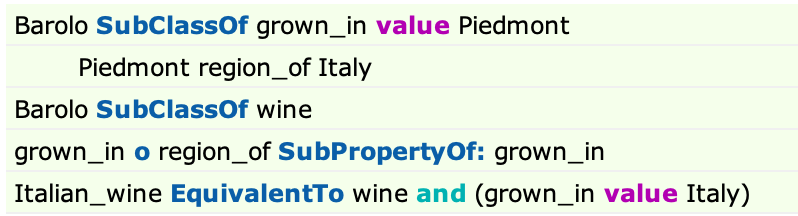

## Exercise 1
1. Please explain, in a few clear sentences, why the reasoner classifies Barolo as an Italian wine.

The reasoner classify Barolo as a Italian wine base on:

`Barolo grown_in value Piedmont`

in which,
* Barolo is subclass of **wine**
* Piedomont is region_of **Italy**
* region_of is subProperty of **grown_in**

thus:

Italian_wine Equivalent ***wine*** and (***grown_in*** value ***Italy***)

2.  Compare the original OWL representation of the wine ontology and its representation as a Neo4j labelled property graph and document the transformation in your own words. How do the representations differ? How was the OWL representation mapped into the Neo4j representation?

    Comparing two different data model, regarding the way to define the entity (or node) and the relationships (or edge) between them. 
    * Nodes in labelled property graph have a uniquely ID and set of key-value pairs that characterise them. relationships have a ID that we can identify them uniquely. 
    * Vertices in owl can be either URIs or Literal Values. relationships are URIs. This means that neither nodes nor edges have an internal structure; they are purely a unique label. This one of the main differences between OWL/RDF and labeled property graphs. OWL generally uses blank nodes in order to represent the OWL axioms as a graph.  
---
## Exercise 2
Please check Exercise2.ipynb (or wine.py and test_wine.py)

---
## Exercise 3
Write a couple of paragraphs on how you might extend the OWL modelling and content to build a knowledge base of individual wines that would be useful to consumers trying to decide what wine to buy.

1. add Cross-lanuage name (e.g. French name)/ alternative name.
2. add 5 basic wine characteristics: Sweetness, Acidity, Tannin, Alcohol, body.
3. add Food pairing information.
4. add Cost, can recommend wine base on price.  
5. add award records.
6. more comprehensive regions information.
